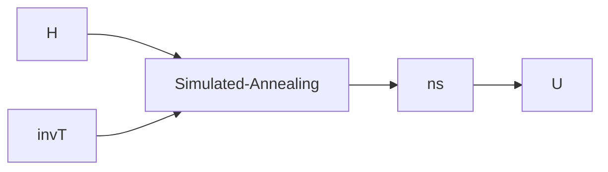

# Curing the QMC Sign Problem using geometric phases

This project is to explore the mitigation of the sign problem for finite-dimensional Hamiltonians using geometric phases of the Hamiltonian.

We calculate the average sign of the Hamiltonian and show that through accounting for the sign of a small subset of closed walks on the off-diagonal terms of the Hamiltonian,
we can significantly improve the average sign of the Hamiltonian through a random search in a space of local unitaries. 

## Summary of the main concepts

The average sign of our Hamiltonian is defined through geometric phases generated by closed walks on the off-diagonal entries of the Hamiltonian. 
More specifically, these geometric phases are generated by decomposing the Hamiltonian into a sum of permutation and diagonal matrices. For more details check out https://arxiv.org/pdf/2012.02022.pdf .

The average sign of a Hamiltonian in our code can simply be computed through a call to the function ``` avsgn(H, invT, convidx) ``` . *H* is the Hamiltonian, *invT* is the inverse temperature for the QMC simulation, and the 
index *convidx* sets a cutoff of the number of closed walks used to compute the average sign. The higher is the *convidx* the more accurate will be the average sign, however, this comes with the expense of more computational time.
For practical purposes, we only need *convidx = 6*, as higher terms are much smaller in their contribution and the average sign already converges for this value. 

### Methodology

We use tensor product of local unitaries to cure the sign problem. We employ a simulated annealing protocol to search for a space of local unitaries. The variable ```ns``` are
contains a list of 3 parameters for each qubit to generate a local unitary rotation through a function call of ```U = unitary(ns)``` . The diagram below illustrates the overall approach to 
generating local unitaries that drastically improve the average sign.

